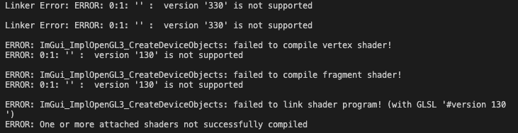

# TinyEngine Debugging

# Trying to get TinyEngine to work on an apple silicon (M1) mac.

## 1. Fixing compile error in example 14

When trying to compile example 14, the following compiler error was yield:

error: implicit instantiation of undefined template 'std::array<unsigned int *, 6>'

This is a clang specific error, as clang does not support instantiations of template functions or classes which are not explicitly defined before instantiation (gcc on the other hand supports that usually). Solution: explicitly include headers for array (array.h) in this file.

## 2. Debugging Segfault(s)

When running any of the examples that use a window, they crash with a segfault.
In order to debug this, I have created a CMakeLists for the examples 1 and 14, that allows to build them using cmake and make (compiled output is “example”). Afterwards, the whole project can be debugged using cmake and lldb.

### 2.1 Audio

Using the debugger, I found out that one segfault was thrown when trying to setup the Audio interface. 
Even though not all examples use Audio, the Audio interface is still initialized in some of the examples by default. To resolve this, all parts in TinyEngine.h that use audio have been removed (commented).

### 2.2 OpenGL related segfaults
Some other segfaults occur when trying to use certain OpenGL functions.

#### Example 14
First. I started to get example 14 to run and investigated different functions. Again, using the debugger, I found the problematic parts. They are in vertexpool.cpp, lines 55 to 57 (glVertexAttribFormat), all of the individual calls causing segfaults.

To solve this, I tried multiple approaches. However, none of them worked. As a test, I decided to just remove those parts and see what would happen. The format function then crashes at glBindVertexBuffer

#### Example 1
After not getting example 14 to work, I tried the easiest example that still uses visualizations, Example 1. 
Again, I created a cmake environment for it and started debugging. Quickly found out the critical point:
Square2D flat;
This calls the constructor of Square2D, which uses the function bind<blm::vec2>.
And to no surprise, this function again uses glBindVertexBuffer, crashing the application.

When not using the Square2D, the program starts with a blank window (although it was expected to render the canyon.png). The following output appears in the terminal:

	
Resources for further investigation:

Probably, a change of the used OpenGL functions is necessary. OpenGL, in general, still works on the M1 mac (although Apple has officially dropped OpenGL support some years ago already).

The following shows an example on how to use glfw to render using OpenGL on the M1 mac, which I found very helpful.
https://carette.xyz/posts/opengl_and_cpp_on_m1_mac/ 
 

Discussion about OpenGL compatibility issues and old shader styles. Also shows how to implement window hints using glfw (which currently is NOT used by TinyEngine, but used in the link above) for Apple support.
https://stackoverflow.com/questions/62990972/why-is-opengl-giving-me-the-error-error-01-version-330-is-not-support

OpenGL glVertexAttribFormat vs glVertexAttribPointer (might be useful for the first part of example 14)
https://gamedev.stackexchange.com/questions/157840/opengl-glvertexattribformat-vs-glvertexattribpointer 
